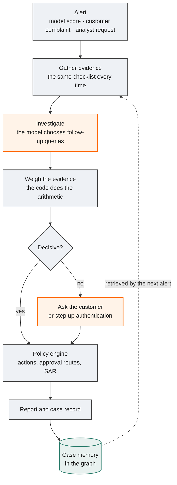
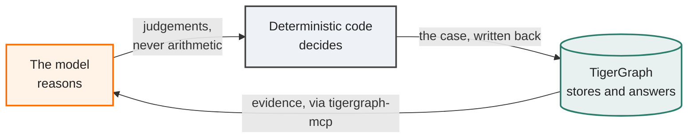
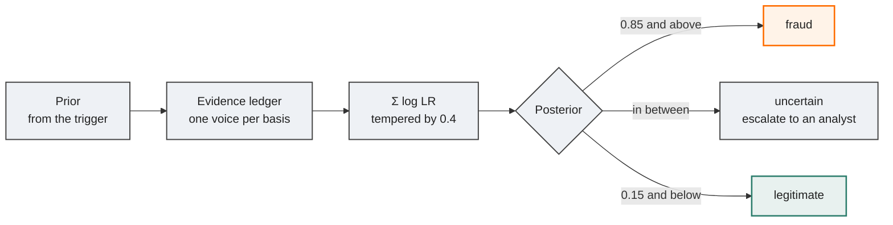
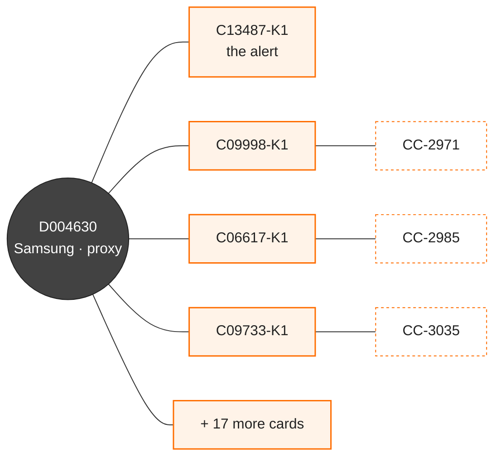

<div align="center">

# RedThread

### An agentic fraud investigator on TigerGraph

A fraud alert arrives. RedThread investigates it across a knowledge graph of 590,000 card
transactions, decides what happened and what the bank should do under its fraud policy, asks for more
evidence when the picture is genuinely unclear, and writes the case back into the graph as memory for
the next investigation.

<br/>


<sub>Built for the TigerGraph Agentic Fraud Investigation challenge · Hacker House Goa 2026</sub>

</div>

---

<div align="center">

**75%** verdict accuracy on 60 replayed closed cases &nbsp;·&nbsp; **0.277** Brier &nbsp;·&nbsp;
**6** legitimate customers wrongly accused, down from 17 &nbsp;·&nbsp; **17** cases correctly left
uncertain and escalated

<sub>Measured on a test we had to fix first — see <a href="#does-it-work">Does it work?</a></sub>

</div>

---

## How an investigation runs



<div align="center"><sub>

Orange is where the model reasons. Grey is where deterministic code decides. Nothing in grey is left
to a language model.

</sub></div>

## Who does what

The division of labour is the whole design. The model is good at choosing what to look at and at
judging what it found; it is bad at arithmetic, at remembering exact identifiers, and at resisting a
conclusion it has already half-formed. So it never does any of those.



| The model reasons | Deterministic code decides | TigerGraph stores and answers |
|---|---|---|
| picks which queries to run | Bayes over the evidence ledger | 21 installed GSQL queries |
| judges each finding: direction, strength, basis | policy rules R1–R10 | TigerVector: policy, typologies, 5,565 closed cases |
| writes the narrative and the SAR | approval routes, exposure, SAR criteria | rings, communities, case memory |
| | names the fraud pattern | point-in-time retrieval, so no case sees its own future |

> [!NOTE]
> The agent reaches TigerGraph only through the official
> [`tigergraph-mcp`](https://github.com/tigergraph/tigergraph-mcp) server, started with a tool
> allowlist: installed queries and vector search, and one dedicated write query for case memory.
> Nothing it can call will change the schema or delete data.

## How a probability is made

The agent does not state a probability. It judges each finding, and the code turns those judgements
into one number that can be replayed, argued with, and taken apart.



The real ledger from case HHG-014, which starts at a prior of 0.50 — an analyst asking for a review —
and ends at 0.94:

| Finding rests on | Direction | Strength | Worth | |
|---|---|---|---|---|
| links to other cards | incriminating | decisive | **×20** | |
| prior cases | incriminating | strong | ×2.8 | halved — rests on the same device as the line above |
| the device | incriminating | strong | ×2.8 | halved — the same device again |
| the holder's behaviour | incriminating | moderate | ×3 | |
| amount and timing | incriminating | moderate | ×3 | |
| region | exculpatory | weak | ÷1.5 | |
| the model score | exculpatory | weak | — | not counted: it already set the prior |

Three of those findings are really one fact about one phone. Left alone they would have multiplied to
×1,280; counted properly they contribute ×160, and the tempering then takes the whole sum down to a
number the evidence can actually support.

Two rules keep it honest. **One voice per basis**: five restatements of the same device fact are one
piece of evidence, not five. **Independence is judged per entity**: findings resting on a device a
stronger finding already used carry half their weight, because three facts about one phone are not
three independent reasons to block someone's card.

## What the graph sees that a model cannot

<table>
<tr><td width="50%" valign="top">

**One case, in one number**

Our own fraud model scored the flagged transaction at **0.0065**. Invisible. Every per-transaction
model would wave it through.

</td><td width="50%" valign="top">

**The same case, in the graph**

One Samsung profile, **21 cards that month**, every one of them with the device new to the account
and behind an anonymous proxy, four already carrying confirmed-fraud cases.

</td></tr>
</table>

The signature lives *across* accounts, which is exactly the thing a per-transaction score cannot
represent.



<details>
<summary><b>The rest of what the data turned out to be</b></summary>

<br/>

- **`customer_id` is not a person.** It is an issuer bucket shared by many unrelated cardholders, so
  "normal for this customer" is meaningless at that level. RedThread resolves **account holders**
  (card + billing region + days since first use) and judges behaviour per holder. That turned 13,553
  buckets into 222,481 real people, and every behavioural signal only became answerable afterwards.
- **The bank's score is beatable.** The closed cases label essentially all fraud from July to
  October, which made a real fraud model trainable. Above 0.85 the bank's risk score is right about
  37% of the time; ours about 92%.
- **A compromised holder stays compromised.** Holders with a prior confirmed-fraud case have 57% of
  their later transactions confirmed as fraud, against a 1.9% base rate. So "consistent with this
  holder's baseline" is evidence *for* fraud once the holder is compromised, and the agent is told
  never to explain away a high model score that way.
- **An undocumented pattern.** One device profile, always new to the account and behind an anonymous
  proxy, across dozens of unrelated cards — a pattern nobody had written down.

</details>

## Does it work?

The benchmark's answer key is hidden, so accuracy is measured by replaying closed cases the bank's
analysts already decided, with point-in-time retrieval (`as_of`) so the agent cannot see its own
outcome or anything that happened later.

> [!WARNING]
> **The first version of that test was wrong, and it flattered us badly.** It gave every confirmed
> case a customer-report trigger and every cleared case a model-score trigger, so the trigger alone
> predicted the answer. An agent that ignored the graph entirely and read only the alert type would
> also have scored full marks. That is where an earlier "24/24 verdicts, Brier 0.005" came from.

The trigger is now drawn independently of the outcome, the flagged transaction's real legacy score is
used instead of a flattering constant, and accuracy is reported **per trigger**, so leaning on the
trigger shows up as a gap between the strata. On the honest test the same pipeline scored **59%**,
with a Brier score of **0.36** — worse than guessing the base rate, because the wrong answers were
delivered at 0.97.

Two defects had been hiding behind the broken exam.

| | What was wrong | What it did |
|---|---|---|
| **Evidence multiplied itself** | One likelihood ratio per basis, compounded, assumes the bases are independent — but device, holder behaviour, region and timing all move together in a real fraud | Six findings became certainty whatever the truth |
| **The customer's reply was a mirror** | The simulated reply was chosen from the prior (`denies = prior >= 0.5`) and then scored against that same prior at eight to one | A case weighed at 0.65 came out at 0.94. It destroyed every `uncertain` verdict before it reached the answer |

The aggregate is now tempered, `logit(posterior) = logit(prior) + 0.4 × Σ log LR`, with the factor
fitted on half the cases and reported on the half it never saw (`scripts/fit_aggregation.py`). The
prior for a customer's denial dropped from 0.6 to a neutral 0.5. And a simulated reply now moves
belief only when it carries information the prior did not already fix — a recurring-charge match,
read out of the holder's history rather than out of the agent's own estimate.

### The same 60 cases, before and after

| | Before | After |
|---|---|---|
| Verdict accuracy | 59% | **75%** |
| Cleared cases left alone | 41% | **80%** |
| Confirmed fraud caught | 77% | 70% |
| Calibration (Brier) | 0.357 | **0.277** |
| **Legitimate customers accused of fraud** | 17 | **6** |
| **Fraud closed as legitimate** | 7 | **3** |
| Left `uncertain` for an analyst | 0 | **17** |

The number to read first is the third from the bottom. Six wrongly accused customers is still six too
many, but it is a third of what the confident version produced, and the cases it now hesitates on are
escalated rather than decided.

### Is it investigating, or reading the alert type?

Each replayed alert is given a customer report or a model score at random, independently of how the
case actually ended. If the agent were leaning on the alert type rather than the evidence, the two
strata would pull apart.

| How the alert arrived | Before | After |
|---|---|---|
| Customer report (n=35) | 54% | **80%** |
| Model alert (n=25) | 67% | **68%** |
| **Gap between the two** | **13 points** | **12 points, and pointing the other way** |

It used to be lopsided because a denial was treated as close to proof. That gap closing is the result
we actually wanted; the headline accuracy is the side effect.

> [!IMPORTANT]
> These cases come from the same generator as the benchmark, and 60 runs carry wide error bars, so
> treat the second decimal place as noise. 75% on a test where half the cases are legitimate is a
> system worth putting **in front of an analyst**, not one worth running unattended — which is
> precisely what the policy engine does with it.

<details>
<summary><b>Measured separately: the pattern classifier, and where it fails</b></summary>

<br/>

Patterns are named by deterministic code, not by the model, because the five documented patterns turn
out to be mechanical — mixed channel in one episode is account takeover in 230 of 230 closed cases.
Measured against every confirmed-fraud closed case (`python scripts/eval_patterns.py`): **96.2%
agreement with the bank's analysts on 4,665 cases**.

It is strong on the four common patterns and genuinely weak on two: **card testing** (recall 0.062 — a
rare pattern, and the labelled episodes list only the fraudulent transactions) and **undocumented**
patterns. Both are displayed in the interface rather than hidden.

**On model selection:** `gemini-3.8-flash` with thinking=high was chosen over `gemini-3.1-pro-preview`
on replayed cases — but that comparison ran on the flawed harness described above, so the margin is
unverified until it is re-run. Finding a broken exam means everything measured with it has to be
re-earned.

</details>

## The interface

A fraud analyst's workbench, not a dashboard. Five routes, each answering one question.

| Route | Answers |
|---|---|
| `/` | what is in front of the team, separating the bank's queue from the alerts the agent raised itself |
| `/case/:id` | why this verdict, what is uncertain, what happens next, who signs it off |
| `/missed` | what continuous monitoring adds over the bank's queue |
| `/rings/:id?` | is this one card, or an organised group |
| `/trust` | should you believe it — including where it fails |

**The thread is a scrubber.** Each investigation is a line down the left of the case file, one node
per step. Arrow keys walk it backwards and the whole case file rewinds with it — the evidence graph
shows only the entities known by then, the belief scale shows where belief stood, the evidence digest
swaps to the tool that ran, and the action plan shows the plan as of then. One control drives five
views, which turns the required narrative into a single continuous move instead of a tour of tabs.

**Belief is shown honestly.** The scale draws an explicit *"no estimate yet"* region, because belief
is genuinely known at only three points and drawing a smooth curve between them would be inventing
data.

**Counterfactuals are live.** Because the ledger arithmetic is deterministic, unticking any line
recomputes the probability *and* the recommended action through the same functions the agent used —
no model call, and no second implementation that can drift.

**Presenter mode.** `/case/:id?replay=1` pushes the stored trace through the same state machine at a
readable pace. It is the real trace, so the demo can be recorded with the workspace suspended and no
API key.

Orange encodes fraud and nothing else — never "selected", never "primary button". An uncertain verdict
gets no hue at all, so it cannot compete with the accent.

## Running it

**Requirements:** Python 3.12 · a TigerGraph 4.2+ workspace (Savanna or Community Edition) · a Gemini
API key.

<details open>
<summary><b>Build the graph</b></summary>

```bash
python -m venv .venv && .venv/Scripts/pip install -e ".[dev]"
cp .env.example .env                              # TigerGraph and Gemini credentials
# put the dataset CSVs in data/

python scripts/train_model.py                     # fraud model + scores        (~4 min)
python scripts/prepare_data.py                    # vertex/edge files           (~1 min)
python scripts/setup_graph.py all                 # schema, load, queries       (~10 min)
python scripts/setup_graph.py queries --only ring_wcc && \
  python -c "from redthread.tg import connection; print(connection().runInstalledQuery('ring_wcc'))"
python scripts/install_algorithms.py              # TigerGraph GDS: tg_louvain
python scripts/build_knowledge.py --fetch         # GraphRAG knowledge base
python scripts/export_ui_data.py                  # ring and community views
```

</details>

<details open>
<summary><b>Investigate</b></summary>

```bash
python scripts/run_cases.py                       # all 20 cases -> cases/
python -m redthread.validate cases                # check every answer file
python scripts/monitor.py --max-alerts 25         # the agent raises its own -> cases_extra/
```

</details>

<details>
<summary><b>Measure</b></summary>

```bash
python scripts/backtest.py --n 60 --month 10 --seed 909   # replayed closed cases
python scripts/fit_aggregation.py                 # fit the tempering, dev/held-out split
python scripts/eval_patterns.py                   # classifier vs 4,665 analyst labels
python -m pytest                                  # policy, ledger, schema, simulator, tools, API
```

</details>

<details>
<summary><b>Open the workbench</b></summary>

```bash
python -m uvicorn redthread.api.app:app --port 8000
cd ui && npm install && npx vite                  # http://localhost:5173
```

</details>

## Repository layout

| Path | What |
|---|---|
| `src/redthread/agent/` | the agent: workflow, MCP client, tools, prompts, simulator, memory |
| `src/redthread/belief.py` | the evidence ledger and its arithmetic |
| `src/redthread/policy.py` | Fraud Policy v1.0 as code |
| `src/redthread/answer.py`, `validate.py` | answer-file schema and dataset checks |
| `src/redthread/api/` | dashboard backend |
| `src/redthread/model/` | fraud model features and score calibration |
| `gsql/` | schema, vector attributes, loading jobs, 21 installed queries |
| `scripts/` | data prep, model training, graph setup, knowledge base, case runner, evaluation |
| `ui/` | the workbench (React, Vite) |
| `cases/` | the 20 answer files |
| `cases_extra/` | 25 alerts the agent raised by itself |

<div align="center">
<br/>
<sub>

Ring detection is our own connected-components pass over *suspicious, new-to-account* device use —
tuned so it finds nine tight rings rather than one 118-card blob formed by chaining through phones
thousands of people share. TigerGraph's GDS `tg_louvain` runs on top of it for the wider
neighbourhood. `tg_pagerank` and `tg_jaccard_nbor_ss` are installed but not run in batch, and this
README does not claim otherwise.

</sub>
</div>
