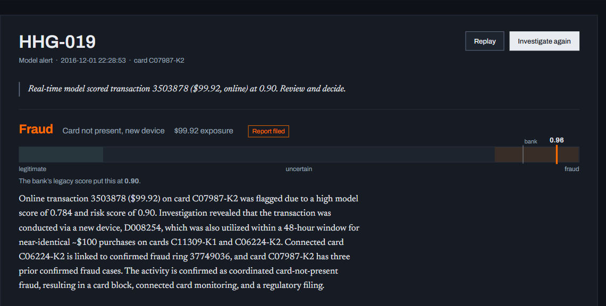
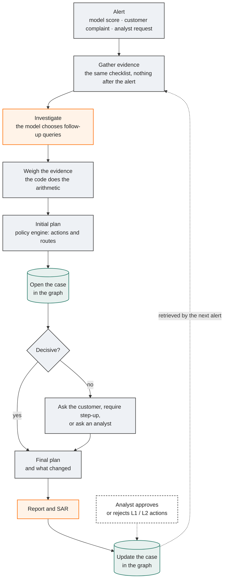
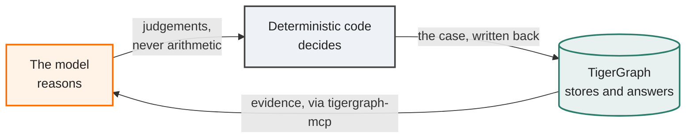
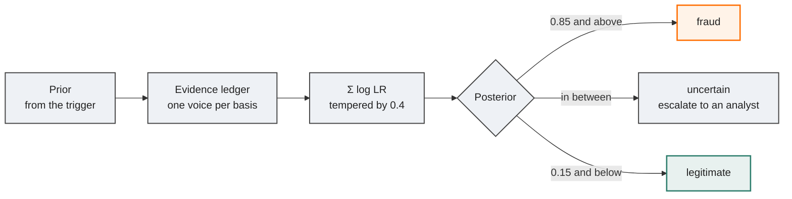
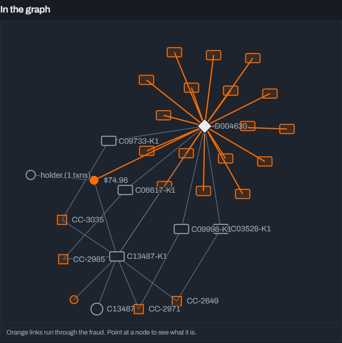
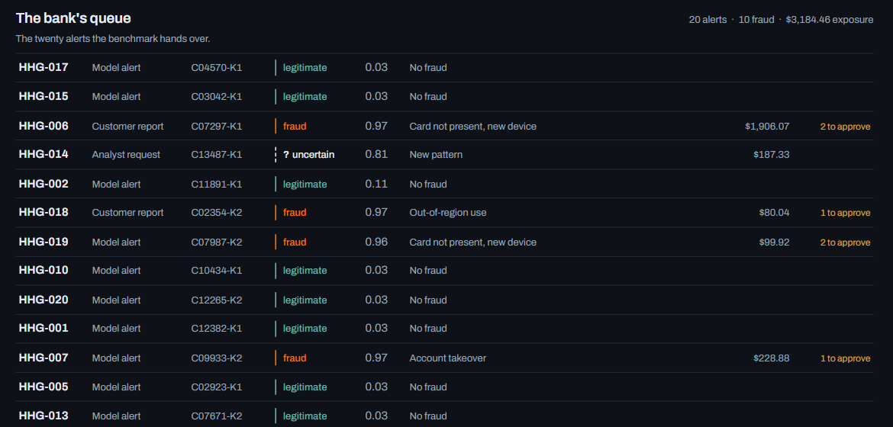

<div align="center">

# RedThread

### An agentic fraud investigator on TigerGraph

A fraud alert arrives. RedThread investigates it across a knowledge graph of 590,000 card
transactions, decides what happened and what the bank should do under its fraud policy, asks for more
evidence when the picture is genuinely unclear, and writes the case back into the graph as memory for
the next investigation.

<br/>


<sub>Built for the TigerGraph Agentic Fraud Investigation challenge · Hacker House Goa 2026</sub>

</div>

---

<div align="center">

**20 / 20** benchmark cases investigated, validated and written to the graph &nbsp;·&nbsp; **0** policy
violations &nbsp;·&nbsp; **1 in 30** legitimate customers wrongly accused on replayed cases &nbsp;·&nbsp;
**4** frauds missed where our fraud model alone misses 7

<sub>Replayed on cases the bank's analysts had already closed, with nothing the investigation could not
have known at the time — see <a href="#does-it-work">Does it work?</a></sub>

<br/>



</div>

---

## What it does

| The brief asks the agent to… | RedThread |
|---|---|
| Investigate a risk score, a customer report or an analyst request | All three trigger types run through one workflow; the 20 benchmark cases include each |
| Gather evidence from the graph, transaction history, device and identity signals, account behaviour, prior cases and external sources | 24 installed GSQL queries over 590,742 transactions, 222,481 resolved account holders and 9,705 device profiles; 5,565 closed cases; FinCEN, FFIEC, FATF and OFAC guidance through GraphRAG |
| Identify the pattern and assess the risk | A deterministic pattern classifier (96.2% agreement with the bank's analysts) and an evidence ledger that turns judged findings into a calibrated probability |
| Create and progress a case | Opened in the graph the moment policy warrants it, updated as it closes, every step recorded as a `CaseEvent` |
| Learn from case memory | Closed cases with their analyst outcomes and notes; the agent's own cases once an analyst has ruled on them; rings and communities that link cases across customers |
| Gather more evidence through controlled actions | Customer validation, step-up authentication or an analyst request, chosen by the policy, with the assumed reply stated |
| Recommend actions within policies and permissions | All 14 policy actions, each routed `auto`, `L1` or `L2`; approvals enforced by role in the workbench |
| Know when to stop | Policy §6: a decisive probability backed by at least two independent pieces of evidence |
| Explain itself | Every action cites its policy rule, every claim cites the query that produced it, and the ledger shows exactly how the probability was built |

## How an investigation runs



<div align="center"><sub>

Orange is where the model reasons. Grey is where deterministic code decides. The case is opened in
the graph as soon as policy says one is warranted, updated when the investigation ends, and updated
again when a person approves or rejects what the agent recommended.

</sub></div>

### One case, start to finish

HHG-001 is a model alert on a $77.07 purchase. The graph shows the charge matches this cardholder's
established weekly payment of about $77, so policy R7 says confirm it with them rather than close it
on their behalf. The agent asks, records the reply it assumed, and changes its plan:

| | Actions (route) | Why |
|---|---|---|
| **Initial plan** | `VERIFY_WITH_CUSTOMER` (auto) · `CREATE_CASE` (auto) | Verify before acting; a case is opened whenever evidence is requested (3a) |
| **Evidence request** | customer validation | The cardholder recognises their own recurring payment |
| **Final plan** | `WARN_CUSTOMER` (auto) · `CLOSE_NO_FRAUD` (auto) | R3: the cardholder confirmed it · R7: a recurring-charge reminder |

The case is closed as legitimate in the graph, with every step recorded, and the stop reason cites
policy §6: the verification settled the question.

## Who does what

The division of labour is the whole design. The model is good at choosing what to look at and at
judging what it found; arithmetic, exact identifiers and approval routes belong to code. So the model
never does any of those.



| The model reasons | Deterministic code decides | TigerGraph stores and answers |
|---|---|---|
| picks which queries to run | Bayes over the evidence ledger | 24 installed GSQL queries |
| judges each finding: direction, strength, basis | policy rules R1–R10 | TigerVector: policy, regulation, 5,565 closed cases |
| writes the narrative and the SAR | approval routes, exposure, SAR criteria | rings, communities, case memory |
| | names the fraud pattern | point-in-time retrieval, so no case sees its own future |

> [!NOTE]
> The agent reaches TigerGraph only through the official
> [`tigergraph-mcp`](https://github.com/tigergraph/tigergraph-mcp) server, started with a tool
> allowlist: installed queries and vector search, and one dedicated write query for case memory.
> Nothing it can call will change the schema or delete data.

## How TigerGraph is used

| | |
|---|---|
| **The graph** | 12 vertex types and 44 edge types: transactions linked in time order (`NEXT`), cards, customers, resolved account holders, device profiles, billing regions, email domains, closed cases, fraud patterns, and the agent's own cases and their events |
| **GSQL** | 24 installed queries: the alert's context, card and holder history, device neighbourhoods, shared-origin lift, linked and similar cases, ring members, community profiles, monitoring sweeps, policy lookup, and the case write-back |
| **Graph algorithms** | Connected components in GSQL (`ring_wcc`) for tight fraud rings, and the GDS library's `tg_louvain` for the wider community a card moves in |
| **TigerVector** | 384-dimension embeddings on 522 policy and regulatory passages, the 5,565 closed cases and the agent's own cases, searched and then expanded by graph traversal |
| **GraphRAG** | The retrieved passage behind every cited rule is attached to the answer as `document` evidence, from the bank's policy and 16 FinCEN, FFIEC, FATF and OFAC sources |
| **MCP** | Every read and write goes through the official `tigergraph-mcp` server, allowlisted to installed queries and vector search |
| **Case memory** | Each case is written as a `FraudCase` with edges to its card, transactions, devices, pattern and connected cards, plus a `CaseEvent` for every step |

## How a probability is made

The agent does not state a probability. It judges each finding, and the code turns those judgements
into one number that can be replayed, argued with, and taken apart.



The real ledger from case HHG-019, a model alert on a $99.92 online purchase. It starts at **0.78**,
the fraud rate the closed cases show for its model score, and ends at **0.96**:

| Finding rests on | Direction | Strength | Worth | |
|---|---|---|---|---|
| links to other cards | incriminating | strong | **×8** | one new device on three cards within 48 hours, near-identical ~$100 purchases |
| prior cases | incriminating | moderate | ×3 | three confirmed-fraud closed cases on this card |
| the device | incriminating | moderate | ×1.7 | halved: the same device as the first line |
| amount and timing | incriminating | moderate | ×1.7 | halved: the same device as the first line |
| the holder's behaviour | incriminating | weak | ×1.5 | no history to support the charge |
| the model score | incriminating | strong | — | not counted: it already set the prior |

Counted naively those lines would multiply to ×324; counted properly they contribute ×108, and
tempering turns that into 0.96. The policy engine then blocks the card (`L1`), opens the case, files a
report (`L2`) because the fraud runs through a shared device (3a, R6), and puts both connected cards
under watch.

Three rules keep it honest. **One voice per basis**: five restatements of the same device fact are
one piece of evidence, not five. **Independence is judged per entity**: findings resting on a device a
stronger finding already used carry half their weight, because three facts about one phone are not
three independent reasons to block someone's card. **Nothing counts twice**: the model score is never
counted again once it has set the prior, and neither is a customer's denial when the alert *is* that
denial.

## What the graph sees that a model cannot

<table>
<tr><td width="50%" valign="top">

**One case, in one number**

Our own fraud model scored the flagged transaction in HHG-014 at **0.0065**. Invisible. Every
per-transaction model would wave it through.

</td><td width="50%" valign="top">

**The same case, in the graph**

One Samsung profile on **20 cards in the month before the alert**, every one of them with the
device new to the account and behind an anonymous proxy, four already carrying confirmed-fraud cases.

</td></tr>
</table>

<div align="center">

</div>

The signature lives *across* accounts, which is exactly the thing a per-transaction score cannot
represent. It fits none of the five documented patterns, so the agent names it `undocumented`,
describes it in its own words, opens the case, puts all 19 connected cards under watch and hands the
ring to an analyst (R6, R9).

<details>
<summary><b>The rest of what the data turned out to be</b></summary>

<br/>

- **`customer_id` is not a person.** It is an issuer bucket shared by many unrelated cardholders, so
  "normal for this customer" is meaningless at that level. RedThread resolves **account holders**
  (card + billing region + days since first use) and judges behaviour per holder. That turned 13,553
  buckets into 222,481 real people, and every behavioural signal only became answerable afterwards.
- **The bank's score is beatable.** The closed cases label essentially all fraud from July to
  October, which made a real fraud model trainable. Above 0.85 the bank's risk score is right about
  37% of the time; ours about 92%.
- **A compromised holder stays compromised.** Holders with a prior confirmed-fraud case have 57% of
  their later transactions confirmed as fraud, against a 1.9% base rate. So "consistent with this
  holder's baseline" is evidence *for* fraud once the holder is compromised, and the agent is told
  never to explain away a high model score that way.
- **An undocumented pattern.** One device profile, always new to the account and behind an anonymous
  proxy, across dozens of unrelated cards — a pattern nobody had written down.

</details>

## It raises its own alerts

Between alerts, two monitors sweep November and December: cards that touch a device from a known
ring, and transactions our model scores high while the bank's score stays low. They raised **25
alerts the bank's queue never did** — the bank had scored 21 of them below 0.30 — and the agent
investigated every one end to end. It caught **9 frauds** worth **$2,300**, 7 of them among the
alerts the bank had scored below 0.30, filed 6 reports, and sent 12 undecided cases to an analyst.
They are in [`cases_extra/`](cases_extra), in the same answer format as the benchmark.

## No shortcuts

An investigation is only as trustworthy as what it was allowed to see. These are enforced in code, not
promised.

| Rule | How |
|---|---|
| **Nothing after the alert** | In the bank's 4,665 confirmed-fraud cases, not one transaction happens after the case was opened. Every evidence window the agent builds stops at the alert (`as_of`), whatever span it asks for. |
| **Rings from history only** | Ring detection runs on July–October data alone and is used as known intelligence through November and December. A device's popularity is the number of cards that had used it *before* the alert, not the all-time count. |
| **No case from the future** | Every lookup of a closed case, a ring member's history or an earlier agent investigation is filtered to cases opened before the alert. |
| **No label from outside** | Nothing reads the public IEEE-CIS files. The fraud model trains only on the bank's closed cases, and its October scores come from a model trained on July–September. |
| **No outcome in its own replay** | A replay builds its rings and calibrates its priors only on months before the one it replays. |
| **Nothing counted twice** | Correlated findings are tempered; the model score and a customer's denial each count once. |
| **Priors measured, not assumed** | A model alert starts from the fraud rate its score band had in the closed cases; a customer report from how often past reports were fraud (4,640 of 4,640). Both stop at 0.90, so evidence always decides. |
| **Memory it can trust** | Every case is written into the graph as memory, but an investigation reads back only cases a person has ruled on, so no verdict ever rests on another unreviewed one. The bank's closed cases are always available. |
| **The model never decides alone** | GSQL finds the facts, the policy engine decides the actions and their approval routes, and the arithmetic is code. The model chooses what to look at and judges what it found. |

## Does it work?

**The 20 benchmark cases.** Every answer file passes the schema and dataset checks
(`redthread.validate`: every ID exists in the data, every action and route is an exact policy
identifier) and an automated audit against the fraud policy (`scripts/check_policy.py`: case versus
report, R1–R10, a cited rule on every action, nothing after the alert) with **zero violations**. All
20 cases are written to the graph.

**Replayed closed cases.** The answer key is hidden, so RedThread is also measured the way a bank
would measure an analyst: on cases its analysts have already closed. 60 of the bank's October cases —
half confirmed fraud, half cleared — are replayed as fresh alerts, point in time: the agent sees
nothing after the alert, its rings and calibration come only from earlier months, and each alert
arrives as a customer report or a model alert dealt at random, so the way it arrives never gives the
answer away.

| 60 replayed closed cases | |
|---|---|
| Right on whom to accuse¹ | **72%** |
| Cleared customers left alone | **97%** |
| Legitimate customers wrongly accused of fraud | **1 of 30** |
| Affected transactions named, precision | **0.94** |
| Agreement with the bank's analysts on filing a report | **82%** |

¹ Fraud called fraud, and a cleared customer not called fraud. When the evidence is thin the agent
does not guess: it escalates to an analyst, as the fraud policy asks.

### The graph does the work

The same cases, judged three ways that use no graph evidence and no language model, next to the
agent. Each probability becomes a verdict by the policy's own thresholds (`scripts/baselines.py`).

| Method (same 60 cases) | Right on whom to accuse | Wrongly accused | Fraud missed |
|---|---|---|---|
| The bank's risk score alone | 50% | 0 of 30 | 12 of 30 |
| The alert type alone | 52% | 17 of 30 | 12 of 30 |
| Our fraud model alone | 68% | 1 of 30 | 7 of 30 |
| **RedThread** (graph + reasoning) | **72%** | **1 of 30** | **4 of 30** |

The fraud model alone is cautious, and misses 7 of the 30 frauds. The graph investigation is what
finds them: RedThread is right on whom to accuse more often than any score, misses the fewest frauds,
and wrongly accuses no more customers than the model does.

### It investigates rather than reading the alert type

Because the alert type is dealt at random, an agent leaning on it would score very differently on
the two kinds of alert. RedThread does not:

| How the alert arrived | Right on whom to accuse |
|---|---|
| Customer report (n=35) | **74%** |
| Model alert (n=25) | **68%** |

<details>
<summary><b>Measured separately: the pattern classifier</b></summary>

<br/>

Patterns are named by deterministic code, not by the model, because the five documented patterns turn
out to be mechanical — mixed channel in one episode is account takeover in 230 of 230 closed cases.
Measured against every confirmed-fraud closed case (`python scripts/eval_patterns.py`): **96.2%
agreement with the bank's analysts on 4,665 cases**, and 0.98 or better recall on card-not-present
fraud, new-device fraud and out-of-region use.

</details>

## The interface

A fraud analyst's workbench, not a dashboard. Five routes, each answering one question.

<div align="center">

</div>

| Route | Answers |
|---|---|
| `/` | what is in front of the team, separating the bank's queue from the alerts the agent raised itself |
| `/case/:id` | why this verdict, what is uncertain, what happens next, who signs it off |
| `/missed` | what continuous monitoring adds over the bank's queue |
| `/rings/:id?` | is this one card, or an organised group |
| `/trust` | should you believe it: replayed accuracy, and the agent against score-only methods |

**The thread is a scrubber.** Each investigation is a line down the left of the case file, one node
per step. Arrow keys walk it backwards and the whole case file rewinds with it — the evidence graph
shows only the entities known by then, the belief scale shows where belief stood, the evidence digest
swaps to the tool that ran, and the action plan shows the plan as of then. One control drives five
views, which turns the required narrative into a single continuous move instead of a tour of tabs.

**Approvals are enforced.** Actions routed `L1` or `L2` wait for a person with that authority; a team
lead cannot approve a regulatory filing. Every decision is written onto the case in the graph, where
the next investigation can see it.

**Counterfactuals are live.** Because the ledger arithmetic is deterministic, unticking any line
recomputes the probability *and* the recommended action through the same functions the agent used —
no model call, and no second implementation that can drift.

**Presenter mode.** `/case/:id?replay=1` pushes the stored trace through the same state machine at a
readable pace. It is the real trace, so a demo can run with the workspace suspended and no API key.

Orange encodes fraud and nothing else — never "selected", never "primary button". An uncertain verdict
gets no hue at all, so it cannot compete with the accent.

## Running it

**Requirements:** Python 3.12 · a TigerGraph 4.2+ workspace (Savanna or Community Edition) · a Gemini
API key.

<details open>
<summary><b>Build the graph</b></summary>

```bash
python -m venv .venv && .venv/Scripts/pip install -e ".[dev]"
cp .env.example .env                              # TigerGraph and Gemini credentials
# put the dataset CSVs in data/

python scripts/train_model.py                     # fraud model + scores        (~4 min)
python scripts/prepare_data.py                    # vertex/edge files           (~1 min)
python scripts/setup_graph.py all                 # schema, load, queries       (~10 min)
python scripts/install_algorithms.py              # TigerGraph GDS: tg_louvain
python scripts/rings.py                           # fraud rings from the labelled history
python scripts/build_knowledge.py --fetch         # GraphRAG knowledge base
python scripts/export_ui_data.py                  # ring and community views
```

</details>

<details open>
<summary><b>Investigate</b></summary>

```bash
python scripts/run_cases.py                       # all 20 cases -> cases/
python -m redthread.validate cases                # every answer file is well-formed
python scripts/check_policy.py                    # ...and obeys the fraud policy, point in time
python scripts/monitor.py --max-alerts 25         # the agent raises its own -> cases_extra/
```

</details>

<details>
<summary><b>Measure</b></summary>

```bash
python scripts/backtest.py --n 60 --month 10 --seed 909 --out backtest_pit.json   # replayed closed cases
python scripts/fit_aggregation.py                 # fit the tempering on a separate sample
python scripts/baselines.py --backtest runs/backtest_pit.json   # the agent vs score-only methods
python scripts/eval_patterns.py                   # classifier vs 4,665 analyst labels
python -m pytest                                  # policy, ledger, schema, simulator, tools, API
```

</details>

<details>
<summary><b>Open the workbench</b></summary>

```bash
python -m uvicorn redthread.api.app:app --port 8000
cd ui && npm install && npx vite                  # http://localhost:5173
```

</details>

## Repository layout

| Path | What |
|---|---|
| `src/redthread/agent/` | the agent: workflow, MCP client, tools, prompts, simulator, memory |
| `src/redthread/belief.py` | the evidence ledger and its arithmetic |
| `src/redthread/policy.py` | Fraud Policy v1.0 as code |
| `src/redthread/answer.py`, `validate.py` | answer-file schema and dataset checks |
| `src/redthread/api/` | workbench backend |
| `src/redthread/model/` | fraud model features and score calibration |
| `gsql/` | schema, vector attributes, loading jobs, 24 installed queries |
| `scripts/` | data prep, model training, graph setup, knowledge base, case runner, monitoring, evaluation |
| `ui/` | the workbench (React, Vite) |
| `cases/` | the 20 answer files |
| `cases_extra/` | 25 alerts the agent raised by itself |
| `tests/` | policy, ledger, schema, simulator, tools and API tests |

<div align="center">
<br/>
<sub>

Ring detection is our own connected-components pass over *suspicious, new-to-account* device use —
tuned so it finds tight rings (eight in the July–October history) rather than one 118-card blob formed
by chaining through phones thousands of people share. TigerGraph's GDS `tg_louvain` runs on top of it
for the wider neighbourhood.

</sub>
</div>
